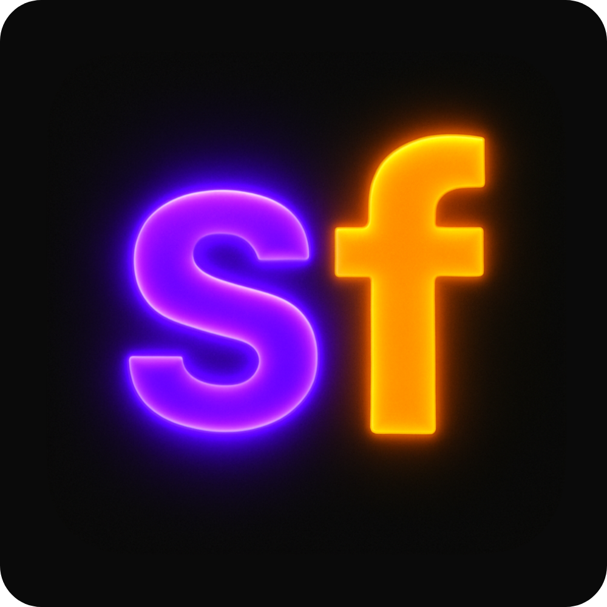

<p align="center">
  
</p>

<h1 align="center">SFPoint</h1>

<p align="center">
  <strong>Open-source screen annotation tool for macOS. Presentify alternative at $0 cost.</strong>
</p>

<p align="center">
  
  
  
  
  
</p>

---

## What is SFPoint?

SFPoint is a **screen annotation overlay** for macOS. Toggle a hotkey, draw on your screen, keep teaching. Arrows, rectangles, circles, freehand, text, laser pointer — all on a transparent overlay that auto-fades after 3 seconds.

Built as a replacement for [Presentify](https://presentify.compzets.com) ($6.99). SFPoint is free, open-source, and fully customizable.

### Features

- **7 annotation tools** — arrow, rectangle, circle, freehand, text, laser pointer, highlighter
- **Toggle-based shortcuts** — Ctrl+key to activate, same key or Esc to deactivate
- **Auto-fade** — annotations disappear after 3 seconds (configurable)
- **Laser pointer** — ambar Google Slides-style, click-through (doesn't block mouse), morado ripple on click
- **No focus stealing** — overlay floats above everything without interrupting your work (native macOS APIs)
- **Click-through** — laser always passes clicks through; other tools only capture when active
- **Floating toolbar** — draggable pill showing current tool and color
- **Rebindable shortcuts** — settings panel (Ctrl+S) to customize keybindings
- **Brand colors** — morado (#8B5CF6) + ambar (#F59E0B) from SaaS Factory

---

## Quick Start

### Prerequisites

- macOS 15+
- Python 3.12+
- [Homebrew](https://brew.sh)

### Install

```bash
# Clone
git clone https://github.com/daniel-carreon/sfpoint.git
cd sfpoint

# Python environment
python3.12 -m venv venv
source venv/bin/activate
pip install -r requirements.txt
```

### Run

```bash
source venv/bin/activate
python3 main.py
```

### Optional: Shell aliases

Add to your `~/.zshrc`:
```bash
alias sfpoint='pkill -f "sfpoint/main.py" 2>/dev/null; sleep 0.5; PYTHONPATH=~/Developer/software/sfpoint/venv/lib/python3.12/site-packages /opt/homebrew/Cellar/python@3.12/3.12.13/Frameworks/Python.framework/Versions/3.12/Resources/Python.app/Contents/MacOS/Python ~/Developer/software/sfpoint/main.py &>/dev/null & disown; echo "SFPoint running"'
alias sfpoint-off='pkill -f "sfpoint/main.py" 2>/dev/null; echo "SFPoint stopped"'
```

---

## Usage

| Action | Shortcut |
|--------|----------|
| **Arrow** | `Ctrl+A` |
| **Rectangle** | `Ctrl+R` |
| **Circle** | `Ctrl+C` |
| **Freehand** | `Ctrl+F` |
| **Text** | `Ctrl+T` (type, Enter to place) |
| **Laser pointer** | `Ctrl+P` (ambar glow trail) |
| **Hide toolbar** | `Ctrl+H` |
| **Settings** | `Ctrl+S` |
| **Undo** | `Cmd+Z` |
| **Clear all** | `Cmd+Shift+Z` |
| **Deactivate** | `Esc` or press same shortcut again |

All tool shortcuts are **toggle-based**: press once to activate, press again (or Esc) to deactivate.

---

## macOS Permissions

SFPoint needs these permissions (System Settings > Privacy & Security):

1. **Accessibility** — for global hotkeys and overlay interaction (add your Terminal app)
2. **Input Monitoring** — for keyboard listener (add your Terminal app)

---

## Architecture

```
Ctrl+Key (pynput) --> Toggle Tool On/Off --> Canvas Overlay (PyQt6 + PyObjC)
                                                    |
                                              QPainter Rendering
                                                    |
                                        Auto-Fade (3s delay + 0.5s fade)
                                                    |
                                          Floating Toolbar (pill UI)
```

Key technical decisions:
- **PyObjC/AppKit** for native macOS window that floats without stealing focus
- **`setIgnoresMouseEvents_`** for click-through toggle (the core innovation)
- **Qt QueuedConnection** for thread-safe signals between pynput and UI
- **QPainter** for all rendering (shapes, laser trail with radial gradients, text)
- **Toggle-based hotkeys** instead of hold-based for better ergonomics

---

## Build It Yourself with Claude

Want to build this from scratch? Copy [`PRP.md`](PRP.md) and paste it to [Claude](https://claude.ai) (or any AI assistant) with:

> "Build this project following the PRP phases. Execute all phases sequentially, validating each one before moving to the next."

The PRP contains the complete blueprint: architecture, gotchas, anti-patterns, and validation steps. It's designed so an AI agent can build the entire project in a single session.

See [`CLAUDE.md`](CLAUDE.md) for detailed development instructions and troubleshooting.

---

## Customization

All configuration lives in `config.py`:

```python
# Shortcuts (toggle-based Ctrl+key)
TOOL_SHORTCUTS = {
    "a": TOOL_ARROW, "r": TOOL_RECT, "c": TOOL_CIRCLE,
    "f": TOOL_FREEHAND, "t": TOOL_TEXT, "p": TOOL_LASER,
}

# Fade timing
FADE_DELAY = 3.0        # seconds before fade starts
FADE_DURATION = 0.5      # seconds for fade animation

# Laser pointer (subtle, elegant)
LASER_DOT_RADIUS = 5.0
LASER_GLOW_RADIUS = 14.0
LASER_TRAIL_LENGTH = 18  # clean, short trail

# Toolbar
TOOLBAR_HEIGHT = 34
TOOLBAR_WIDTH = 180
```

Custom shortcuts are saved to `settings.json` via the settings panel (Ctrl+S).

---

## Cost Comparison

| | Presentify | SFPoint |
|---|---|---|
| Cost | $6.99 one-time | Free |
| Customizable | Limited | Fully |
| Open source | No | Yes |
| Laser pointer | Red | Ambar (Google Slides-style) |
| Auto-fade | Yes | Yes (configurable) |
| Rebindable shortcuts | No | Yes |

---

## Troubleshooting

| Problem | Solution |
|---------|----------|
| Tool doesn't activate | Grant Accessibility + Input Monitoring to your Terminal |
| Overlay steals focus | Verify pyobjc-framework-Cocoa: `pip install pyobjc-framework-Cocoa` |
| Font warning in console | Cosmetic — uses system font `.AppleSystemUIFont` |
| Python version error | Requires 3.12+ (`list[]` generics, `\|` union syntax) |
| `sfpoint` alias not found | Run `source ~/.zshrc` after adding aliases |

---

## License

MIT License. Do whatever you want with it.

---

<p align="center">
  Built with Claude Opus 4.6 in a single session.<br>
  <sub>From <a href="https://github.com/daniel-carreon">daniel-carreon</a> — <strong>SF</strong>Point</sub>
</p>
