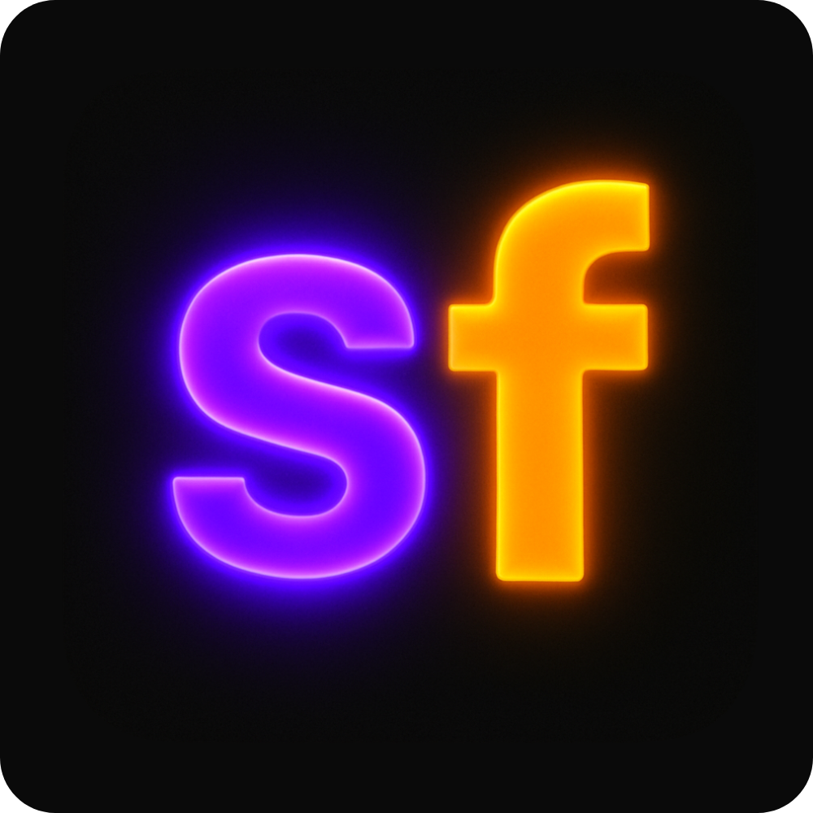

<p align="center">
  
</p>

<h1 align="center">SFPoint</h1>

<p align="center">
  <strong>A laser pointer for your Mac screen. One shortcut, nothing else.</strong>
</p>

<p align="center">
  
  
  
  
  
</p>

---

## What is SFPoint?

A neon laser pointer that floats over everything on macOS. Press `⌥P` to cycle it:

```
off  →  ambar  →  morado  →  off
```

That is the entire app. No tools, no toolbar, no modes to learn. It lives in the
menu bar, never steals focus, and never blocks a click.

v2.0 deliberately removed arrows, rectangles, circles, freehand, text, the
highlighter, the floating toolbar and the settings panel. A tool you never use is
a tool that can break.

### Features

- **One shortcut** — `⌥P` cycles off → ambar → morado → off. `Esc` kills it.
- **Two brand colors** — ambar `#F59E0B` and morado `#8C27F1`.
- **Never blocks the mouse** — the overlay is click-through, always.
- **Click shockwave** — every click paints a ripple in the opposite color.
- **Multi-monitor** — one overlay per screen, the trail crosses them seamlessly.
- **Idle when off** — no timers, no listeners, no windows. ~0% CPU.
- **Cheap when on** — a single 60fps timer repainting only the dirty rect.
- **Menu bar mirror** — the icon becomes a colored dot showing the active color,
  and its menu can drive the laser even if macOS revokes the hotkey permission.

---

## Install

```bash
git clone https://github.com/daniel-carreon/sfpoint.git
cd sfpoint
bash build.sh --install
```

That builds the `.app`, signs it, replaces `/Applications/SFPoint.app` and
launches it. First run asks for **Input Monitoring**; grant it and you are done.

Dev mode:

```bash
python3 -m venv venv && ./venv/bin/pip install -r requirements.txt
./venv/bin/python main.py
```

---

## Usage

| Action | How |
|--------|-----|
| Cycle laser (off → ambar → morado) | `⌥P` |
| Turn off | `Esc` or `⌥P` on morado |
| Pick a color directly | Menu bar icon |
| Start with macOS | Menu bar > "Iniciar con macOS" |
| Quit | Menu bar > "Salir" |

---

## macOS permission

SFPoint needs exactly one: **Input Monitoring**
(System Settings > Privacy & Security > Input Monitoring).

It is what lets the app hear `⌥P` while another app is focused. Without it the
laser still works from the menu bar, and the app tells you instead of going
quiet.

### If the shortcut stops working after a rebuild

macOS ties a permission to the app's code signature. An **ad-hoc** signature has
no stable identity, so every rebuild produces a new hash, the stored record stops
matching, and macOS denies the permission **silently** while still showing the
app as enabled in System Settings. The log tells the truth:

```
Failed to match existing code requirement for subject
so.saasfactory.sfpoint and service kTCCServiceListenEvent
```

Fix the record, then restart the app:

```bash
tccutil reset ListenEvent so.saasfactory.sfpoint
```

Fix it permanently by signing with a stable self-signed identity (Keychain
Access > Certificate Assistant > Create a Certificate, type "Code Signing"):

```bash
SIGN_ID="Your Cert Name" bash build.sh --install
```

`build.sh` warns loudly whenever it has to fall back to ad-hoc signing.

---

## Architecture

```
⌥P (pynput listen-only tap)  ──►  cycle state  ──►  one overlay per screen
                                                    (PyObjC floating panel,
                                                     click-through, no focus)
                                                            │
                                                    QPainter: radial-gradient
                                                    bloom + 3-pass neon trail
```

- **PyObjC / AppKit** — `NSFloatingWindowLevel + 1`, `NSWindowStyleMaskNonactivatingPanel`
  and `setIgnoresMouseEvents_(True)` give an overlay that floats above everything,
  never takes focus and never eats a click.
- **Global coordinates** — state is stored in screen space; each overlay
  translates its painter, so nothing breaks across monitors.
- **Dirty-rect repaints** — only the bounding box of the dot, trail and ripples
  is repainted, never the full screen.
- **Balanced cursor hiding** — `CGDisplayHideCursor` is a counter, not a flag.
  Every hide is counted and undone on exit; leaking them hides the user's cursor
  system-wide with no way back.
- **Qt QueuedConnection** — pynput runs on its own thread; every signal into Qt
  is queued.

```
main.py              tray icon, state machine, permission watchdog
config.py            colors, geometry, the one shortcut
core/hotkey.py       ⌥P + Esc (pynput)
core/laser.py        the renderer (dot, trail, ripple)
core/permissions.py  Input Monitoring: preflight, request, repair
ui/canvas.py         per-screen overlays + frame loop
```

---

## License

MIT. Do whatever you want with it.

---

<p align="center">
  <sub>From <a href="https://github.com/daniel-carreon">daniel-carreon</a> — <strong>SF</strong>Point</sub>
</p>
